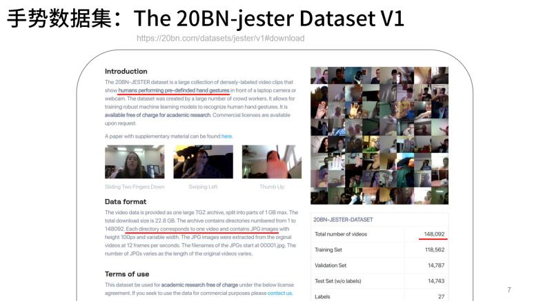

数据集：https://20bn.com/datasets/jester/v1#download

### 一些研究

- Deep Learning for Videos: A 2018 Guide to Action Recognition

  http://blog.qure.ai/notes/deep-learning-for-videos-action-recognition-review

- Pattern recognition （CVIU / IEEE TIP）

  https://github.com/jinwchoi/awesome-action-recognition
  
- Vocalization sign language iOS App with deep learning using CoreML.

  https://github.com/ardamavi/Vocalization-Sign-Language-iOS

- 3D Hand Tracking using input from a depth sensor.

  https://github.com/FORTH-ModelBasedTracker/HandTracker

### 论文

- Non-Local Neural Networks - X. Wang et al., CVPR2018. [code]

- Video Action Transformer Network - R. Girdhar et al., CVPR2019. [project web]

### Github上的项目

- 人体、面部、手部关键点识别，动作识别: https://github.com/pzf0000/MPPE

- 深度学习，CV 例子项目，人体部分，包含：姿势骨架、手势骨架、姿势识别、手势识别、面部侦测等等: https://github.com/leftatrium2/AIDemo

-  Flutter Packge 以实现摄像头精确追踪并识别十指的运动路径/轨迹和手势动作, 且输出22个手部关键点以支持更多手势: https://github.com/zhouzaihang/flutter_hand_tracking_plugin

### 学习材料

见文件 nndl-ebook.pdf